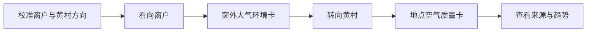

# 窗外与方向空气环境 AR：调研与产品方案

日期：2026-09-21。状态：早期方案草案。0.2.0 已实现双方向校准、信息卡和在线模型数据入口，当前实现与验收状态见 [项目 README](../README.md)；本文中的模拟优先方案保留为设计背景。

## 1. 已确认的目标与建议

用户已确认：当前没有执法人员接触，先做能够向领导展示、同时保留真实环境数据需求的空间效果；目前没有真实数据，先使用明确标注的模拟案例。空气环境优先，碳后续扩展。

建议首版定位为「窗外与方向空气环境信息层」：把空气质量数据放在用户正在看的空间方向上，让人同时理解“窗外这一片环境”和“黄村方向的区域空气状态”。它是空间信息演示，不宣称眼镜正在测量空气，也不替代执法系统。

首版包含两个已确认效果，第三个效果待补充：

1. **窗外大气环境：** 用户看向窗户，出现窗外区域的空气环境层，包括空气质量等级、主要指标、更新时间和简化的风向/环境背景。窗户是空间入口，数据代表所选区域或监测站，不是透过玻璃即时采样。
2. **黄村方向空气卡片：** 用户看向预先校准的黄村方向，出现黄村（地点名称待确认）的空气质量指标、主要污染物、趋势和数据来源。若最终地点是黄村公园，则在卡片中显示“黄村公园”；若是黄村地区，则显示区域名，不把二者混用。

原“黄村公园信息卡”因此保留为第二个效果的空间触发方式；地下管网暂不进入这一轮空气环境主线。模拟数据不绑定真实企业，也不声称窗外或黄村实际存在某种污染。

核心价值假设：当人正在观察现场、对照仪器或核实设施时，眼镜减少现场与手机之间的来回切换。区域报表、长表单和完整案卷仍适合电脑或手持端。是否比现有手机流程更有效，需要实测。

## 2. 调研得到的业务依据

以下是公开资料研究，未做用户访谈，也未接触目标单位内部系统。

| 公开依据 | 对本方案的启发（设计推断） |
| --- | --- |
| 生态环境部 2025 年通知提出用非现场数据发现线索，异常时结合监测装备开展有针对性的检查。[通知](https://www.mee.gov.cn/xxgk2018/xxgk/xxgk05/202507/t20250709_1123118.html) | 眼镜优先承接已研判、已安排的核查任务，展示依据与待办；不以一条告警自动发起正式检查。 |
| 北京公开的“三监联动”案例将监测、监管、执法衔接起来，并有 VOCs 走航与现场检查相结合的实践。[案例](https://www.beijing.gov.cn/ywdt/gzdt/202412/t20241231_3978120.html) | 产品应连通线索、对象、现场记录，而非止于一个浓度卡片。案例说明业务存在，不证明 AR 已有收益。 |
| 2026 年起施行的《生态环境监测条例》强调监测方案、设备维护校准、异常处理及数据质量。[条例](https://www.mee.gov.cn/zcwj/gwywj/202511/t20251106_1132216.shtml) | 数值旁应保留采样时间、来源、质量标记；“无新数据”不能显示成“正常”。 |
| HJ 633—2026 自 2026-03-01 实施，更新 AQI 方法并增加数据完整性要求。[现行 AQI 技术规定](https://www.mee.gov.cn/ywgz/fgbz/bz/bzwb/jcffbz/202602/t20260225_1144441.shtml) | 瞬时、分钟、小时及日统计口径分开；首版不拿单个分钟值自行生成正式 AQI。 |

这些资料说明空气数据应保留点位、时间、来源和质量信息，也说明未来可以扩展到“异常线索—现场核查”。但当前没有执法人员访谈，因此本轮不把核查流程写成已经验证的用户需求；先把它作为第二阶段方向。

## 3. 首版场景选择

| 场景 | 适合展示的内容 | 当前判断 |
| --- | --- | --- |
| 窗外大气环境 | 空气质量等级、PM₂.₅ / PM₁₀、O₃、风向、更新时间 | 推荐第一个效果。领导一眼能理解“看向窗外后出现环境信息”。 |
| 黄村方向空气卡片 | 区域空气质量、主要污染物、趋势、数据来源、位置说明 | 推荐第二个效果。保留原先地点卡片的空间记忆点。 |
| 颗粒物高值核查 | PM₂.₅ / PM₁₀、邻近点位、趋势、风况、待核查对象 | 后续业务版。需要执法人员确认真实流程后再做。 |
| VOCs 高值核查 | 走航轨迹、组分或仪器读数、采样条件、企业设施信息 | 后续优先候选。需要明确仪器方法和报告口径，不能把不同“VOCs”读数直接互比。 |
| 臭氧污染过程 | O₃、气象、时间变化及区域背景 | 适合区域研判扩展；不能凭眼前高值和风向自动归因给最近企业。 |
| 碳数据现场核对 | 企业核算周期、能源活动数据、计量设备及核算资料 | 单独扩展。与空气浓度监测共享对象身份，不混用指标或判断。 |

首版空气层只表示“某个区域或站点的数据状态”，不把环境质量直接等同于窗外当前空气，也不把风向箭头做成污染扩散结论。若使用 AQI，必须标出它的发布点位、发布时间和统计口径。

## 4. 两个效果如何同时服务领导展示与未来业务

**领导演示视图：理解空间方向和数据关系。**

- 先显示校准提示和两个方向标签：窗户、黄村（名称待确认）。
- 看向窗户时，显示一张半透明的窗外环境卡；看向黄村方向时，切换为地点空气卡。
- 通过时间轴或 Beam Pro 控制器切换“当前值 / 过去一小时趋势”，让观众看到数据是有时间范围的。
- 在旁观者模式中显示一个小型区域图，说明数据来自哪个区域或监测站；不制造连续的三维污染云。

**未来业务视图：为真实使用留下入口。**

- 在地点卡中保留“数据详情 / 监测点 / 待核查”三个入口；当前只实现前两个。
- 主卡始终显示指标、单位、时间、来源和“演示数据”标记；质量未知时显示未知。
- 将来再加入线索、核查清单和记录，不在没有业务访谈时虚构执法表单。

两个效果采用同一套空气数据结构，只改变空间触发位置和内容层级。提供区域模型预览或过程录屏供旁观者理解；当前硬件的真实环境混合录制/投屏能力需要单独实测，不能先承诺观众能看到完整第一视角。

## 5. 五分钟模拟案例脚本：窗户 → 黄村方向

所有站名、地点、读数、时间、风况均为合成数据，使用“示范区域 A”，不挂真实单位名称。以下数值仅是剧情素材，不是限值。

1. **校准方向。** 用户在室内选择窗户方向和黄村方向，分别放置一个方向标签；界面提示“方向为本次演示校准”。
2. **看向窗户。** 窗边出现“窗外大气环境”卡：空气质量等级、PM₂.₅、PM₁₀、O₃、风向、模拟更新时间。背景使用淡色的空气流线或区域色带，不画成真实污染云。
3. **看向黄村。** 用户转向第二个标签，显示“黄村空气质量”（若确认是公园，则显示“黄村公园空气质量”）：主要污染物、过去一小时趋势、数据来源和“区域/站点数据”说明。
4. **查看依据。** 点击一个指标，展开采样点、统计周期、更新时间、质量状态和“不是眼镜现场测量”的说明。
5. **领导回顾。** 退出空间卡后，在概览中并列比较窗外区域与黄村方向，展示数据时间差异和地点关系；不自动给出污染归因或执法结论。



演示中的空间模型用于表达数据与地点的关系；首版不生成铺满现场的“污染云”。稀疏站点不足以还原连续三维浓度场，将来若接模型结果，必须标注模型、时间、适用范围和不确定性。

## 6. 眼镜中具体看什么

建议主卡的文字线框如下；实际字号与排布必须戴机验证。

```text
窗外大气环境                       演示数据
空气质量：良
PM₂.₅  28 μg/m³    PM₁₀  46 μg/m³
O₃     91 μg/m³    风向  东北
区域参考 · 模拟时间 14:10 · 来源：模拟站点
数据状态：有效（模拟）

[趋势]       [数据来源]       [关闭]
```

采用三层信息：扫一眼识别点位及状态；点击看趋势和依据；需要时打开记录表。详细记录和文字输入优先放手持端。领导汇报常用的全区排名、长周期统计保留在概览中，不长期占据行走视野。

| 数据 | 首版展示 | 接真实数据时必须明确 |
| --- | --- | --- |
| PM₂.₅、PM₁₀ | 主卡一个重点指标，另一项在详情 | μg/m³；采样/平均时间；监测方法；质控标记 |
| AQI | 首版可以省略；后续接官方发布值 | 发布点位、发布时间、实时报/日报及标准版本；不当作单企业排放达标结论 |
| O₃、NO₂ 等 | 保留数据结构，按业务扩展 | 统计周期、方法和适用判定依据 |
| 气象 | 风向、风速及观测时刻 | 风向按来向表示；输送箭头若使用须另标去向；显示观测位置，不能假设代表全片区 |
| 地点关系 | 窗户、黄村方向、区域或站点名称 | 方向校准方式；数据代表范围；不能暗示窗外即时测量 |
| 设备/数据状态 | 有效、质控中、异常、缺测、断更 | 采样时间与接收时间分别保存，质量未知就标未知 |

环境空气浓度、厂界/排口排放数据和便携仪筛查读数分开呈现。需要比较限值时，绑定适用对象、工况、统计周期、规范版本及来源。GB 3095—2026 存在分阶段安排，不能从网页摘一个数字对所有数据画红线。[标准修订解读](https://www.mee.gov.cn/ywdt/zbft/202602/t20260225_1144479.shtml)

## 7. AR 交互与显示

当前用户已实机确认青色立方体在转头、侧移时留在原处；这是会话内空间稳定性验证。方向校准、业务界面、户外配准、持久锚点尚未验收。

- 室内首次演示：用户选择参考方向，手动放置三个模拟点位。标注“室内模拟方向”，不显示虚假的真实距离或地理定位精度。
- 头部朝向只用于聚焦和预览，不是眼动追踪。用 Beam Pro 确认打开、保存及切换；具体按键映射在 SDK 实机阶段验证。保存记录不会由注视自动触发。
- 标签绑定场景位置，详情面板可放在舒适阅读位置；行走时收起大图表，一键隐藏全部业务浮层。
- 先尝试约 2 米的阅读距离，再按设备与使用者测试调整；避免小字、细线、大面积动画以及强迫频繁大角度转头。
- XREAL 的显示指南提示黑色表现为透明，因此不能照搬手机的黑底遮挡效果。采用较粗文字、清晰轮廓和克制的亮色面板，分别在浅墙、复杂背景、明亮环境下验收。指南部分举例针对 XREAL Light，具体参数不直接当作 Air 2 Ultra 的验收标准。[显示指南](https://docs.xreal.com/Design%20Guide/Display)
- 聚焦、选中、保存三个反馈分开；同时使用文字/图标和颜色。XREAL 官方将头向与控制器作为可结合的输入方式，我们据此提出当前交互方案。[控制指南](https://docs.xreal.com/Design%20Guide/Controlling)
- 跟踪丢失或校准被重置时，撤下精确位置叠加并提示重新校准。后续可研究定位点/图像标记；扫码确定对象身份与精确空间配准是两件事。

## 8. 数据与实现边界

第一版离线运行，用一个本地场景文件驱动窗户方向、黄村方向、空气指标、趋势、状态和模拟时钟。只做两个方向卡、一个概览和一次数据详情展开，尽量不引入大型模型或额外在线服务。

最小数据字段：点位/对象 ID、对象类型、坐标及参考系、定位方式与不确定性、指标、数值、单位、统计周期、采样时间、接收时间、来源、方法、质量状态、演示标记。线索独立保存触发依据和人工核查状态；记录保存所查看的数据快照与操作时间。

接入顺序建议：模拟 JSON → 经授权且脱敏的历史数据回放 → 公开空气质量只读数据 → 业务系统只读接口。公开网站可用于背景查询，但公开页面不等于稳定、获授权的数据接口。附近站点的数据也不能改名成“眼前这里的实时空气”。

眼镜负责显示与交互；实际测量仍来自监测站、走航或便携仪。正式现场记录未来要对接原系统的身份权限、留痕和资料管理；本地草稿不宣称自动满足执法证据要求。当前眼镜的环境适用性、连续使用和户外可读性还需现场试用。

## 9. 后续碳模块如何衔接

在同一企业/设施对象下另开“碳数据核对”页：核算周期、核算边界、活动数据、排放因子及版本、计算结果、资料来源。生态环境部于 2026 年发布第二版国家温室气体排放因子数据库，可作为后续核算资料入口之一；具体仍按适用行业方法选择。[数据库发布](https://www.mee.gov.cn/ywgz/ydqhbh/wsqtkz/202603/t20260301_1145117.shtml)

不从 PM₂.₅、AQI 或公园绿化面积直接推导碳排放；CO₂ 浓度与 CO₂e 核算量分开。首版只在方案中预留该方向，避免分散空气核查主线。

## 10. 开发顺序与验收

| 阶段 | 可审阅产物 | 进入下一阶段的条件 |
| --- | --- | --- |
| A：效果确认 | 本方案、两个方向效果、主卡线框 | 确认窗户与黄村方向名称，以及第三个效果；没有业务联系人时保留假设制作概念版 |
| B：离线演示 | 窗户卡、黄村卡、方向切换、趋势与来源详情 | 实机完成整条流程；文字可读；演示标记全程存在；方向切换不误触 |
| C：业务试用 | 脱敏真实案例回放与同数据手机对照 | 业务人员确认字段与术语，识别实际有价值的现场环节 |
| D：现场试点 | 单片区、少量点位、只读数据接入 | 坐标与方向配准、延迟、权限、户外显示经过验证后再谈规模化 |

建议 B 阶段检查：断网可完成流程；窗口与黄村方向都能独立校准；转头切换不会连续误触；数据卡始终显示来源、时间和演示标记；校准丢失能恢复；重开应用是否需要重校准有清晰说明。

建议邀请 3–5 位目标业务人员做形成性试用（尚未开展）：在眼镜和手机上查看同一案例，轮换使用顺序，观察找到点位与依据所需时间、对象选错/误判次数、遗漏的核查信息、可读性和不适情况。小样本用于改设计，不宣称统计证明效率提升。若眼镜没有改善具体环节，则保留手持流程，调整 AR 用途。

## 11. 后续应向业务联系人确认的三件事

1. “房村”是否指之前的“黄村公园”、黄村地区，还是另一个地点？最终卡片名称需要准确确认。
2. 窗户效果希望更偏真实数据面板、空气流动的可视化，还是窗外区域的地图/监测点关系？
3. 第三个效果是什么？可以继续沿用地下管网，也可以做空气扩散趋势、碳数据或另一处地点；名称和触发方向确定后再纳入同一套信息架构。

用户无需替专业人员回答。此阶段已足以形成概念方案，后续用真实业务反馈修正；不能把公开政策和我们的设计推断写成已经验证的用户需求。
